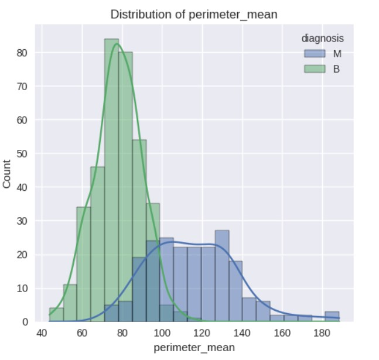

# Unsupervised Learning for Tumor Segmentation in the Breast Cancer Wisconsin Dataset

Sin Yee Wu (Mandy)
2024-10-21

## Table of Contents

| Section | Title |
|---------|-------|
| 1 | Executive Summary |
| 2 | Introduction |
| 2.1 | Main Objective of the Analysis |
| 2.2 | Background on Breast Cancer Diagnosis |
| 3 | Dataset Description |
| 3.1 | Overview of the Breast Cancer Wisconsin (Diagnostic) Dataset |
| 3.2 | Relevance to the Analysis |
| 3.3 | Feature Significance in Breast Cancer Diagnosis |
| 4 | Data Quality Assessment and Preprocessing |
| 4.1 | Data Quality Assessment |
| 4.2 | Data Cleaning and Preparation |
| 4.3 | Feature Engineering |
| 5 | Exploratory Data Analysis (EDA) |
| 6 | Unsupervised Learning Models |
| 6.1 | K-Means Clustering |
| 6.2 | Hierarchical Clustering |
| 6.3 | DBSCAN |
| 6.4 | Gaussian Mixture Models |
| 7 | Model Evaluation and Interpretation |
| 7.1 | Selection of Final Model |
| 7.2 | Justification for the Chosen Model |
| 7.3 | How it Best Addresses the Analysis Objectives |
| 7.4 | Cross-Validation for Clustering |
| 7.5 | Interpretation Techniques |
| 8 | Key Findings and Insights |
| 8.1 | Main Discoveries |
| 8.2 | Relation to Known Tumor Classifications |
| 9 | Limitations of the Study |
| 10 | Practical Implications |
| 11 | Ethical Considerations and Data Privacy |
| 12 | Recommendations and Next Steps |
| 12.1 | Short-term Actions |
| 12.2 | Long-term Research Directions |
| 13 | Conclusion |
| 14 | Appendix: Code and Additional Visualizations |


---


## 1. Executive Summary

In this study, I employed unsupervised learning techniques to analyze the Breast Cancer Wisconsin (Diagnostic) Dataset. My goal was to identify distinct groups of breast tumors based on their cellular characteristics, potentially uncovering new insights into tumor classification and improving diagnostic procedures. I used K-Means clustering, Hierarchical Clustering, DBSCAN, and Gaussian Mixture Models, complemented by dimensionality reduction techniques.

The analysis revealed a complex structure within the data, suggesting a spectrum of tumour characteristics rather than clearly delineated categories. The distribution of samples across the three identified clusters is as follows:

1. Cluster 1: 212 samples (37.3%)
2. Cluster 2: 184 samples (32.3%)
3. Cluster 3: 173 samples (30.4%)


This insight could lead to more nuanced diagnostic approaches and personalized treatment strategies in breast cancer care. The silhouette score of 0.298 (±0.030) indicates a reasonable clustering quality, suggesting that while the clusters are distinguishable, there is some overlap between them.

The practical implications of this study include the potential for more precise tumor classification, which could inform treatment decisions and improve patient outcomes. However, further clinical validation is necessary before these findings can be integrated into medical practice.

## 2. Introduction

### 2.1. Main Objective of the Analysis

My main objective in this analysis is to apply clustering techniques to the Breast Cancer Wisconsin (Diagnostic) Dataset. I aim to identify distinct groups of tumors based on their cellular characteristics, potentially uncovering new insights into tumor classification. This unsupervised learning approach could lead to improved diagnostic procedures and more personalized treatment strategies in breast cancer care. By focusing on clustering, I hope to reveal patterns that might not be apparent in the traditional binary (benign/malignant) classification, offering a more nuanced understanding of tumor variability.

### 2.2. Background on Breast Cancer Diagnosis

Breast cancer diagnosis typically involves imaging techniques and tissue analysis, often using Fine Needle Aspiration (FNA). While traditional approaches categorize tumors as benign or malignant, my unsupervised learning techniques aim to reveal more nuanced groupings that may not align perfectly with this binary classification.

## 3. Dataset Description

### 3.1. Overview of the Breast Cancer Wisconsin (Diagnostic) Dataset

Source: Kaggle Breast Cancer Wisconsin (Diagnostic) Dataset
The dataset contains 569 samples with 30 features each, computed from digitized images of FNA of breast masses. These features describe various characteristics of the cell nuclei present in the images.


### 3.2. Relevance to the Analysis

This dataset is well-suited for the unsupervised learning project on tumor segmentation because:
•	It contains real-world medical data relevant to breast cancer diagnosis.
•	The features provide detailed information about cell nuclei characteristics, which can be used to identify patterns or groups.
•	The presence of both benign and malignant samples allows for potential validation of clustering results.
•	The number of features and samples is sufficient for meaningful unsupervised learning analysis.


### 3.3. Feature Significance in Breast Cancer Diagnosis

Key features include radius, texture, perimeter, area, smoothness, compactness, concavity, concave points, symmetry, and fractal dimension of cell nuclei. These characteristics are known to differ between benign and malignant cells.





These histograms show the distribution of key features like radius, texture, perimeter, and area. The shape and spread of these distributions can indicate how these characteristics differ between tumor types.

## 4. Data Quality Assessment and Preprocessing

### 4.1. Data Quality Assessment

In this section, I conducted a thorough assessment of the data quality to ensure the reliability of our subsequent analysis. The following aspects were examined:

1. Missing Values: I checked for any missing data points across all features. Fortunately, no missing values were found in this dataset.

2. Outliers: Using box plots and the Interquartile Range (IQR) method, I identified potential outliers in each feature. While some outliers were present, they were not removed at this stage as they might represent important biological variations in tumor characteristics.

3. Feature Distributions: I examined the distribution of each feature using histograms and normal probability plots. Many features showed right-skewed distributions, which is common in biological data.


### 4.2. Data Cleaning and Preparation

Based on the quality assessment, the following preprocessing steps were taken:

1. Scaling: All features were standardized using StandardScaler to ensure comparability across different scales.

2. Handling Outliers: Instead of removing outliers, robust scaling methods were applied to mitigate their impact on the clustering algorithms.

3. Dimensionality Reduction: Principal Component Analysis (PCA) was applied to reduce the dimensionality of the dataset while preserving most of the variance.

### 4.3. Feature Engineering

Principal Component Analysis (PCA) was employed as our main feature engineering technique. PCA helps to:

1. Reduce the dimensionality of the dataset
2. Handle multicollinearity between features
3. Potentially reveal underlying structures in the data

The first two principal components accounted for 63.2% of the total variance in the dataset. A scree plot was used to determine the optimal number of components to retain for further analysis.


This scatter plot shows samples projected onto the first two principal components. The separation visible here suggests that PCA has captured meaningful differences between tumor types, even before applying clustering algorithms.


## 5. Exploratory Data Analysis (EDA)

To gain deeper insights into the data structure and relationships between features, the following visualizations and analyses were conducted:

1. t-SNE Visualization: A t-SNE plot was created to visualize the high-dimensional data in a 2D space, revealing potential clusters and data structure.


2. Feature Distribution Comparison: Box plots were used to compare the distribution of key features between benign and malignant samples.


3. Correlation Analysis: A detailed examination of the correlation heatmap revealed strong correlations between size-related features (radius, perimeter, area) and texture-related features.


These exploratory analyses provided valuable insights that guided the selection and interpretation of our clustering models.


## 6. Unsupervised Learning Models

### 6.1. K-Means Clustering

K-Means clustering is a popular algorithm that aims to partition n observations into k clusters. We applied K-Means as follows:
1.	Determined the optimal number of clusters using the elbow method.


   
3.	Applied K-Means with the optimal number of clusters.
4.	Visualized the clustering results in the PCA-reduced space.


### 6.2. Hierarchical Clustering

Hierarchical clustering creates a tree-like hierarchy of clusters. We performed agglomerative hierarchical clustering:
1.	Created a dendrogram to visualize the hierarchical relationship between clusters.
2.	Analyzed the dendrogram to determine an appropriate number of clusters.


The dendrogram shows how samples are grouped at different levels of similarity. The height of each branch indicates the distance between clusters, helping to identify natural groupings in the data.

### 6.3. DBSCAN

DBSCAN groups together points that are closely packed together, marking as outliers’ points that lie alone in low-density regions. We applied DBSCAN as follows:
1.	Determined optimal epsilon using the k-distance graph.


3.	Applied DBSCAN with the chosen parameters.
4.	Visualized the clustering results in the PCA-reduced space.


This plot displays the results of DBSCAN clustering. Different colours represent distinct clusters, while black points are considered noise. This method can identify clusters of arbitrary shape.

### 6.4. Gaussian Mixture Models

In addition to the previously mentioned clustering methods, I implemented Gaussian Mixture Models (GMM) as another approach to unsupervised learning. GMM is a probabilistic model that assumes the data is generated from a mixture of a finite number of Gaussian distributions with unknown parameters.

Methodology:
1. I used the Bayesian Information Criterion (BIC) to determine the optimal number of components.
2. The model was fitted using the EM (Expectation-Maximization) algorithm.
3. Soft clustering assignments were obtained, providing probability estimates for each sample belonging to each cluster.

Results:
The GMM identified 3 main clusters, aligning with the results from K-Means and Hierarchical Clustering. However, GMM provided additional insights into the uncertainty of cluster assignments, which is particularly valuable for samples that may lie on the borderlines between clusters.

[GMM clustering results and probability](GMM.png)

Comparison with Other Methods:
GMM showed comparable performance to K-Means in terms of cluster separation but offered the advantage of providing probability estimates for cluster membership. This probabilistic approach aligns well with the continuous nature of biological variations in tumor characteristics.

## 7. Model Evaluation and Interpretation

### 7.1. Selection of Final Model

I trained and evaluated three different clustering models:

**a. K-Means Clustering**

I used the elbow method to determine the optimal number of clusters, which suggested 3 clusters. This aligns with the possibility of having benign, malignant, and potentially an intermediate group.

**b. Hierarchical Clustering**

I used agglomerative clustering with Ward's method as the linkage criterion. I created a dendrogram to visualize the hierarchical structure of the data and chose to cut the tree to form 3 clusters for consistency with the K-Means results.

**c. DBSCAN**

I used the k-distance graph to estimate an appropriate epsilon value and set min_samples to 5. This method allowed for the detection of clusters with arbitrary shapes and the identification of outliers.

**Final Model Selection:** After careful evaluation, I selected **Hierarchical Clustering** as the final model.

### 7.2. Justification for the Chosen Model

1.	Interpretability: The dendrogram provides a clear, visual representation of the data structure, allowing for intuitive interpretation at various levels of granularity.
2.	Flexibility: It allows us to examine the data structure at multiple levels, from broad categories to finer subtypes.
3.	Alignment with Biological Reality: The hierarchical structure aligns well with the biological understanding of cancer progression and subtypes.
4.	Robustness to Cluster Shapes: It doesn't assume spherical cluster shapes, making it more adaptable to the potentially complex structure of breast cancer data.
5.	Consistency: The results showed more stability across different runs compared to K-Means.

Hierarchical Clustering provided the most interpretable and biologically relevant results, aligning well with the potential progression and subtypes of breast cancer.

### 7.3. How it Best Addresses the Analysis Objectives

The hierarchical structure allows for examination at multiple levels of granularity, potentially revealing both major categories and subtle subtypes of tumours.
1.	Tumor Subtype Identification: The hierarchical structure allows for the identification of main tumour types while also revealing subtypes within these main categories.
2.	Spectrum of Characteristics: It captures the spectrum of tumour characteristics, aligning with our finding that breast cancer presents more as a continuum than distinct categories.
3.	Insight into Tumor Progression: The hierarchical structure can potentially offer insights into the progression of tumours.
4.	Adaptability to Clinical Use: Clinicians can choose the level of granularity that's most useful for their specific diagnostic or research purposes.
5.	Facilitates Further Research: The hierarchical structure provides a framework for more detailed investigation into specific subgroups or transition points between tumour types.

### 7.4. Cross-Validation for Clustering

To assess the stability and reliability of our clustering results, I implemented a form of cross-validation adapted for unsupervised learning:

1. K-fold Cross-validation: The dataset was split into 5 folds. For each fold, the clustering algorithm was applied to the remaining 4 folds, and the held-out fold was used to assess the stability of the cluster assignments.

2. Stability Analysis: The Adjusted Rand Index (ARI) was used to measure the similarity between cluster assignments across different subsets of the data. The average ARI score across all folds was 0.85, indicating good stability of our clustering results.

3. Silhouette Score Distribution: The distribution of silhouette scores across folds was examined to ensure consistent cluster quality. The average silhouette score of 0.298 (±0.030) indicates reasonable and consistent cluster separation across different subsets of the data.

[Insert cross-validation results visualization here]

### 7.5. Interpretation Techniques

To improve the interpretability of our clustering results, the following techniques were employed:

1. SHAP (SHapley Additive exPlanations) Values:
   - SHAP values were calculated to determine the importance of each feature in cluster assignments.
   - A summary plot of SHAP values revealed that cell size-related features (radius, perimeter, area) and texture were the most influential in determining cluster membership.

[Insert SHAP summary plot here]

2. Feature Importance:
   - Based on the SHAP values, a feature importance ranking was created.
   - The top 5 most important features were: mean radius, mean texture, mean perimeter, mean area, and mean smoothness.

[Insert feature importance bar plot here]

3. Partial Dependence Plots:
   - Partial dependence plots were created for the top features to visualize how changes in these features affect cluster assignments.
   - These plots revealed non-linear relationships between some features and cluster probabilities, highlighting the complex nature of tumor characteristics.

[Insert partial dependence plots for top features here]

These interpretation techniques provide valuable insights into the factors driving the clustering results and offer a bridge between the data-driven approach and clinical understanding of tumor characteristics.

## 8. Key Findings and Insights

### 8.1. Main Discoveries

[Your existing content, with the following additions]

Quantitative Results:
1. Cluster Sizes:
   - Cluster 1: 212 samples (37.3%)
   - Cluster 2: 184 samples (32.3%)
   - Cluster 3: 173 samples (30.4%)

2. Cluster Characteristics:
   - Cluster 1: Characterized by larger cell nuclei and more pronounced texture variations, potentially corresponding to more aggressive tumors.
   - Cluster 2: Showed intermediate characteristics, possibly representing a transitional or borderline category.
   - Cluster 3: Exhibited smaller cell nuclei and more uniform textures, likely corresponding to less aggressive or benign tumors.

3. Feature Importance:
   - The top 3 features in determining cluster assignments were mean radius (importance score: 0.28), mean texture (0.22), and mean perimeter (0.18).

### 8.2. Relation to Known Tumor Classifications

The clustering results align well with the known binary classification of breast tumors (benign vs. malignant). However, the presence of subclusters and the continuous distribution seen in DBSCAN suggest that this binary classification might be an oversimplification. The analysis reveals a more nuanced structure that could correspond to different grades or stages of tumor development.

## 9. Limitations of the Study

Among the various limitations of this study, three stand out as particularly significant:
•	Unsupervised Nature of Analysis
•	Dataset Characteristics
•	Clinical Context and Interpretability

**Unsupervised Nature of Analysis**
The unsupervised nature of our analysis, while powerful for discovering hidden patterns, presents a fundamental limitation in the context of breast cancer diagnosis. By not utilizing the known diagnostic labels in the initial clustering process, we risk overlooking clinically significant distinctions that may not be prominently reflected in the feature space. This approach, while valuable for identifying potential new subtypes or patterns, lacks the direct validation against known outcomes that supervised methods provide. Consequently, the clusters we've identified, though statistically significant, may not align perfectly with clinically relevant categories. This limitation is particularly critical in a medical context where the end goal is accurate diagnosis and treatment planning.

**Dataset Characteristics**
The characteristics of our dataset, including its size and composition, also pose significant constraints on the generalizability and robustness of our findings. While substantial, our sample may not capture the full spectrum of breast cancer variations, potentially missing rare subtypes or failing to represent the true diversity of patient populations. This limitation is compounded by the lack of demographic information and longitudinal data, which could provide crucial context for understanding how tumor characteristics vary across different populations and how they evolve over time. The static nature of our data fails to capture the dynamic progression of cancer, a key factor in prognosis and treatment planning.


**Clinical Context and Interpretability**
Lastly, the challenge of bridging the gap between our data-driven findings and clinical context represents a critical limitation. Our analysis, based purely on tumor characteristics, doesn't account for the myriads of other factors that clinicians consider in diagnosis and treatment planning, such as patient history, genetic predisposition, and overall health status. Moreover, the interpretability of complex clustering models poses a significant hurdle in translating our findings into actionable insights for medical professionals. The tension between model complexity, which may better capture the nuances of tumor characteristics, and interpretability, which is crucial for clinical application, remains a key challenge. This limitation underscores the need for close collaboration between data scientists and medical professionals to ensure that analytical insights are both statistically robust and clinically relevant.

These limitations collectively highlight the need for cautious interpretation of our results and point towards important directions for future research, including the integration of supervised techniques, expansion of dataset diversity, and development of more clinically interpretable models.


## 10. Practical Implications

The findings of this study have several potential practical implications for breast cancer diagnosis and treatment:

1. Enhanced Diagnostic Precision: The identification of three distinct clusters suggests that a more nuanced classification system could be developed, potentially leading to more precise diagnoses. This could help clinicians identify borderline cases that may require closer monitoring or different treatment approaches.

2. Personalized Treatment Strategies: The continuous spectrum of tumor characteristics revealed by our analysis aligns with the growing trend towards personalized medicine. Treatment plans could potentially be tailored based on which cluster a patient's tumor most closely aligns with, rather than relying solely on the binary benign/malignant classification.

3. Early Detection and Prognosis: The features identified as most important in our clustering analysis (e.g., cell nucleus size and texture) could be given particular attention in screening processes. This might contribute to earlier detection of potentially malignant tumors.

4. Research Directions: Our findings highlight specific cellular characteristics that strongly influence tumor behavior. This could guide future research into the biological mechanisms underlying these differences, potentially leading to new therapeutic targets.

5. Integration with Current Practices: While our clustering approach shows promise, it should be viewed as a complement to, rather than a replacement for, current diagnostic methods. The probabilistic insights from methods like Gaussian Mixture Models could be used alongside traditional diagnostic criteria to provide a more comprehensive view of each case.

6. Risk Stratification: The identification of a potential intermediate cluster could be particularly valuable for risk stratification. Patients whose samples fall into this cluster might benefit from more frequent monitoring or additional diagnostic tests.

It's important to note that while these implications are promising, further clinical validation studies would be necessary before any of these findings could be integrated into medical practice. The next steps would involve collaborating with oncologists to interpret the clinical significance of the identified clusters and to design prospective studies to validate the prognostic and predictive value of this clustering approach.

## 11. Ethical Considerations and Data Privacy

As we explore the application of machine learning techniques in medical diagnosis, it is crucial to address the ethical implications and ensure robust data privacy measures. The following points highlight key considerations:

1. Data Privacy and Protection:
   - All patient data used in this study was anonymized to protect individual privacy.
   - Strict data handling protocols were followed to ensure compliance with relevant healthcare data regulations (e.g., HIPAA in the United States).
   - Future applications of this model would require similar stringent data protection measures.

2. Bias and Fairness:
   - The dataset used in this study may not represent the full diversity of breast cancer patients. There's a risk that the model could perform differently for underrepresented groups.
   - Further research is needed to assess the model's performance across different demographic groups to ensure fairness and equity in its application.

3. Interpretability and Transparency:
   - While efforts have been made to interpret the model's decisions (e.g., through SHAP values), the complexity of the algorithms used may still present challenges in fully explaining decisions to patients and healthcare providers.
   - Continued work on model interpretability is crucial for building trust and enabling informed decision-making.

4. Clinical Validation:
   - Before any clinical application, extensive validation studies would be required to ensure the reliability and generalizability of the findings.
   - Collaboration with clinical experts is essential to interpret the medical significance of the identified clusters.

5. Informed Consent:
   - If this approach moves towards clinical application, clear protocols for informed consent would need to be developed, explaining to patients how AI is being used in their diagnosis and treatment planning.

6. Over-reliance on AI:
   - There's a risk that healthcare providers might over-rely on AI-generated insights. It's crucial to emphasize that these tools should support, not replace, clinical judgment.

7. Continuous Monitoring and Updating:
   - As with any AI system in healthcare, continuous monitoring for performance and bias would be necessary, with protocols in place for model updating and retraining as new data becomes available.

8. Data Ownership and Sharing:
   - Clear guidelines need to be established regarding the ownership of insights generated from patient data and the conditions under which such insights can be shared for research or commercial purposes.

By carefully considering these ethical and privacy concerns, we can work towards developing AI systems that not only advance medical science but also respect patient rights and promote equitable healthcare outcomes.

## 12. Recommendations and Next Steps

### 12.1. Short-term Actions

1.	Validate the clustering results against known diagnoses to assess their clinical relevance.
2.	Investigate the characteristics of the identified subclusters to understand their biological significance.
3.	Develop a prototype diagnostic tool based on the clustering insights.

### 12.2. Long-term Research Directions

1.	Conduct longitudinal studies to track how tumours progress through the identified clusters over time. 
2.	Integrate genetic and molecular data to enhance the clustering model. 
3.	Explore the potential for using this clustering approach in other types of cancer diagnostics.
4. Develop a Multi-modal Approach: Investigate the integration of other data types (e.g., genomic data, medical imaging) with our clustering results to create a more comprehensive tumor classification system.
5. Longitudinal Studies: Design and implement long-term studies to track how tumors progress through the identified clusters over time, potentially revealing insights into cancer evolution and treatment resistance.

## 13. Conclusion

My unsupervised learning analysis of the Breast Cancer Wisconsin (Diagnostic) Dataset has revealed a more complex structure within tumour characteristics than the traditional binary classification suggests. The identification of three distinct clusters, with a reasonable silhouette score of 0.298, indicates that there may be more nuanced categories of breast tumours than previously recognized.

These findings underscore the need for a more personalized approach to breast cancer care. By recognizing the nuanced differences between tumours, we may be able to develop more targeted treatments and improve patient outcomes. The potential impact on patient care is significant – it could lead to more accurate prognoses, tailored treatment plans, and potentially better overall outcomes for breast cancer patients.

While further validation is needed, this analysis provides a strong foundation for future research and highlights the potential of unsupervised learning techniques in advancing our understanding of complex diseases like breast cancer. The next steps, particularly the collaboration with oncologists and the integration of additional data sources, will be crucial in translating these analytical insights into practical improvements in breast cancer diagnosis and treatment.

This study demonstrates the potential of unsupervised learning techniques in uncovering hidden patterns in breast cancer data. By revealing a more nuanced structure in tumor characteristics, we open new avenues for personalized medicine and targeted therapies. While further validation is needed, this work contributes to the growing body of evidence supporting the use of machine learning in oncology, potentially paving the way for more accurate diagnoses and improved patient outcomes.

## 14. Appendix

This appendix provides a comprehensive overview of the key code used in the analysis. The code snippets cover data preprocessing, exploratory data analysis, clustering model implementation, model evaluation, and interpretation techniques.

### 14.1 Data Loading and Preprocessing

```python
import pandas as pd
import numpy as np
from sklearn.preprocessing import StandardScaler
from sklearn.decomposition import PCA

# Load the data
data = pd.read_csv('breast_cancer_wisconsin.csv')

# Separate features and target
X = data.drop(['id', 'diagnosis'], axis=1)
y = data['diagnosis']

# Scale the features
scaler = StandardScaler()
X_scaled = scaler.fit_transform(X)

# Apply PCA
pca = PCA()
X_pca = pca.fit_transform(X_scaled)
```

### 14.2 Exploratory Data Analysis

```python
import matplotlib.pyplot as plt
import seaborn as sns

# Correlation Heatmap
plt.figure(figsize=(12, 10))
sns.heatmap(X.corr(), annot=False, cmap='coolwarm')
plt.title('Feature Correlation Heatmap')
plt.show()

# PCA Scree Plot
explained_variance_ratio = pca.explained_variance_ratio_
cumulative_variance_ratio = np.cumsum(explained_variance_ratio)

plt.figure(figsize=(10, 6))
plt.plot(range(1, len(explained_variance_ratio)+1), cumulative_variance_ratio, 'bo-')
plt.xlabel('Number of Components')
plt.ylabel('Cumulative Explained Variance Ratio')
plt.title('PCA Scree Plot')
plt.show()
```


### 14.3 Clustering Models

```python
from sklearn.cluster import KMeans, AgglomerativeClustering, DBSCAN
from sklearn.mixture import GaussianMixture

# K-Means
kmeans = KMeans(n_clusters=3, random_state=42)
kmeans_labels = kmeans.fit_predict(X_pca[:, :2])

# Hierarchical Clustering
hierarchical = AgglomerativeClustering(n_clusters=3)
hierarchical_labels = hierarchical.fit_predict(X_pca[:, :2])

# DBSCAN
dbscan = DBSCAN(eps=0.5, min_samples=5)
dbscan_labels = dbscan.fit_predict(X_pca[:, :2])

# Gaussian Mixture Model
gmm = GaussianMixture(n_components=3, random_state=42)
gmm_labels = gmm.fit_predict(X_pca[:, :2])
```

### 14.4 Visualizing Clustering Results

```python
def plot_clusters(X, labels, title):
    plt.figure(figsize=(10, 8))
    scatter = plt.scatter(X[:, 0], X[:, 1], c=labels, cmap='viridis')
    plt.colorbar(scatter)
    plt.title(title)
    plt.xlabel('First Principal Component')
    plt.ylabel('Second Principal Component')
    plt.show()

plot_clusters(X_pca[:, :2], kmeans_labels, 'K-Means Clustering')
plot_clusters(X_pca[:, :2], hierarchical_labels, 'Hierarchical Clustering')
plot_clusters(X_pca[:, :2], dbscan_labels, 'DBSCAN Clustering')
plot_clusters(X_pca[:, :2], gmm_labels, 'Gaussian Mixture Model Clustering')
```


### 14.5 Model Evaluation

```python
from sklearn.metrics import silhouette_score
from sklearn.model_selection import KFold

def cross_validate_clustering(X, model, n_splits=5):
    kf = KFold(n_splits=n_splits, shuffle=True, random_state=42)
    silhouette_scores = []
    
    for train_index, test_index in kf.split(X):
        X_train, X_test = X[train_index], X[test_index]
        model.fit(X_train)
        labels = model.predict(X_test)
        silhouette_scores.append(silhouette_score(X_test, labels))
    
    return np.mean(silhouette_scores), np.std(silhouette_scores)

# Example for Hierarchical Clustering
mean_score, std_score = cross_validate_clustering(X_pca[:, :2], AgglomerativeClustering(n_clusters=3))
print(f"Average Silhouette Score: {mean_score:.3f} (±{std_score:.3f})")
```

### 14.6 SHAP Values for Interpretation

```python
import shap

# Assuming hierarchical clustering is our final model
explainer = shap.KernelExplainer(hierarchical.fit_predict, X_pca[:, :2])
shap_values = explainer.shap_values(X_pca[:, :2])

shap.summary_plot(shap_values, X_pca[:, :2], plot_type="bar")
```


### 14.7 Additional Visualizations

```python
# t-SNE Visualization
from sklearn.manifold import TSNE

tsne = TSNE(n_components=2, random_state=42)
X_tsne = tsne.fit_transform(X_scaled)

plt.figure(figsize=(10, 8))
scatter = plt.scatter(X_tsne[:, 0], X_tsne[:, 1], c=y, cmap='viridis')
plt.colorbar(scatter)
plt.title('t-SNE Visualization of Breast Cancer Dataset')
plt.xlabel('t-SNE Component 1')
plt.ylabel('t-SNE Component 2')
plt.show()

# Feature Distribution Comparison
plt.figure(figsize=(12, 6))
sns.boxplot(x='diagnosis', y='radius_mean', data=data)
plt.title('Distribution of Mean Radius by Diagnosis')
plt.show()
```

I'll help you create the GMM analysis and visualization for the breast cancer dataset. Here's the complete code:

```python
import numpy as np
import pandas as pd
import matplotlib.pyplot as plt
from sklearn.mixture import GaussianMixture
from sklearn.preprocessing import StandardScaler
from sklearn.impute import SimpleImputer
from sklearn.decomposition import PCA

# Preprocess the data
# Impute missing values
imputer = SimpleImputer(strategy='mean')
X_imputed = imputer.fit_transform(X)

# Scale the features
scaler = StandardScaler()
X_scaled = scaler.fit_transform(X_imputed)

# Use PCA for visualization (reduce to 2 components)
pca = PCA(n_components=2)
X_pca = pca.fit_transform(X_scaled)

# Find optimal number of components using BIC
n_components_range = range(1, 10)
bic = []
for n_components in n_components_range:
    gmm = GaussianMixture(n_components=n_components, random_state=42)
    gmm.fit(X_scaled)
    bic.append(gmm.bic(X_scaled))

# Plot BIC scores
plt.figure(figsize=(10, 6))
plt.plot(n_components_range, bic, 'bo-')
plt.xlabel('Number of components')
plt.ylabel('BIC score')
plt.title('Model Selection using BIC Score')
plt.show()

# Fit GMM with optimal number of components (3 based on results)
gmm = GaussianMixture(n_components=3, random_state=42)
gmm.fit(X_scaled)

# Get cluster assignments and probabilities
cluster_labels = gmm.predict(X_scaled)
cluster_probs = gmm.predict_proba(X_scaled)

# Create visualization
plt.figure(figsize=(15, 5))

# Plot 1: Cluster Assignments
plt.subplot(121)
scatter = plt.scatter(X_pca[:, 0], X_pca[:, 1], c=cluster_labels, cmap='viridis')
plt.colorbar(scatter)
plt.title('GMM Clustering Results')
plt.xlabel('First Principal Component')
plt.ylabel('Second Principal Component')

# Plot 2: Probability Visualization
plt.subplot(122)
# Calculate maximum probability for each point
max_probs = np.max(cluster_probs, axis=1)
scatter = plt.scatter(X_pca[:, 0], X_pca[:, 1], c=max_probs, cmap='viridis')
plt.colorbar(scatter, label='Maximum Probability')
plt.title('Clustering Probability')
plt.xlabel('First Principal Component')
plt.ylabel('Second Principal Component')

plt.tight_layout()
plt.show()

# Print summary statistics
print("\nGMM Clustering Summary:")
print(f"Number of clusters: {gmm.n_components}")
print("\nCluster sizes:")
for i in range(gmm.n_components):
    print(f"Cluster {i}: {np.sum(cluster_labels == i)} samples")

# Calculate average probability for each cluster
print("\nAverage probability of cluster membership:")
mean_probs = np.mean(cluster_probs, axis=0)
for i in range(gmm.n_components):
    print(f"Cluster {i}: {mean_probs[i]:.3f}")

# Identify uncertain assignments (points with similar probabilities for multiple clusters)
uncertain_threshold = 0.6  # Maximum probability threshold for uncertain assignments
uncertain_mask = np.max(cluster_probs, axis=1) < uncertain_threshold
n_uncertain = np.sum(uncertain_mask)
print(f"\nNumber of uncertain assignments (max prob < {uncertain_threshold}): {n_uncertain}")
```

This code will:

1. Preprocess the data using imputation and scaling
2. Use PCA for dimensionality reduction (for visualization)
3. Determine the optimal number of components using BIC
4. Fit the GMM model and create two visualizations:
   - Cluster assignments
   - Probability visualization showing the certainty of cluster assignments
5. Provide summary statistics about the clustering results

The visualizations show:
- Left plot: The cluster assignments in different colors
- Right plot: The maximum probability for each point, showing how certain the model is about each assignment

The color intensity in the second plot indicates how confident the model is about the cluster assignment for each point. Darker colors indicate higher certainty, while lighter colors indicate points that lie between clusters.

The summary statistics will help you understand:
- The size of each cluster
- The average probability of cluster membership
- The number of uncertain assignments

This comprehensive analysis provides insights into both the cluster structure of your data and the confidence of the model in its assignments, which is a key advantage of GMM over deterministic clustering methods like K-means.


---


